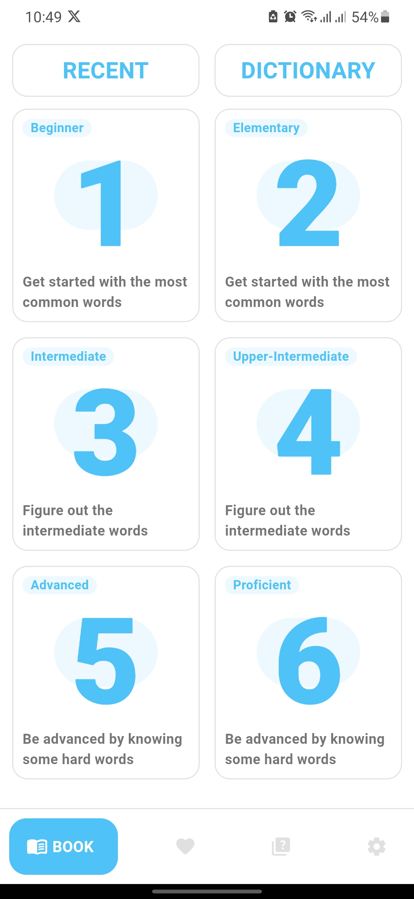

# ewords
eWords is an offline mobile app designed to help students learn English by providing common words categorized by proficiency level. Feel free to contribute and improve the app!

# Book Tab
### This tab displays all the app book words with their levels
  
